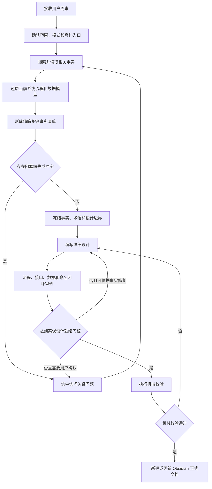

# Obsidian Solution Designer 插件设计规格

- 日期：2026-07-20
- 状态：已完成交互设计确认，待用户审阅书面规格
- 插件名称：`obsidian-solution-designer`
- 技能名称：`obsidian-solution-designer`
- 显示名称：需求驱动详细方案设计
- 命令：`/obsidian-solution-designer:design`

## 1. 背景与目标

本插件面向“依据用户需求完成详细方案设计”的工作。它先以代码、数据库、中间件配置、需求资料和用户确认为事实基础完成调研，再产出符合 Obsidian 知识库规范的后端或全栈详细设计文档。

Obsidian 是文档交付规范，不是设计对象。插件的核心价值是把需求和现有系统事实转换为可供下一阶段直接编写实现设计的稳定设计基线。

成熟设计必须达到以下目标：

- 事实、命名和设计依据可以追溯。
- 业务流程、前后端交互、服务调用和异常路径完整闭环。
- 接口与数据库达到字段级精度。
- 流程图、接口契约、数据模型和正文保持一致。
- 后续人员无需重新猜测业务语义、字段含义、交互顺序或状态规则。
- 文档符合目标 Obsidian 知识库的 YAML、callout、双链、标签和版本规范。

## 2. 非目标

本插件不负责：

- 编写 PRD 或替代产品需求确认。
- 输出具体代码、方法内部实现或详细算法。
- 生成逐文件编码步骤、开发任务拆分或实现计划。
- 生成可执行 DDL 或数据库迁移脚本。
- 在资料不足时虚构类、表、字段、接口、中间件能力或业务规则。
- 未经用户明确要求修改代码仓库、数据库或其他业务系统。
- 在关键信息不足时生成没有实施价值的半成品设计文档。

## 3. 设计原则

### 3.1 强制调研，禁止猜测

正式设计前必须读取与当前需求有关的真实资料。资料目录不限定为 `docs/`，而是包括：

- 用户指定的一个或多个代码仓库、分支或版本。
- 数据库结构、数据库实例、基线文件和迁移记录。
- 缓存、消息队列、任务调度、对象存储及第三方服务配置。
- PRD、需求说明、原型、会议纪要和用户指定的任意参考资料。
- Obsidian 知识库中的同主题文档和关联笔记。

代码、数据库、配置和文档不一致时，必须区分“当前系统事实”和“目标需求”，不能自行裁决冲突。影响设计的缺失信息必须询问用户。

### 3.2 关键信息不足时不产出文档

缺少影响范围、业务规则、接口、数据模型、命名或流程闭环的关键信息时：

1. 停止正式设计。
2. 完成一次精简调研，合并重复问题。
3. 只向用户返回会改变设计结果的阻塞问题。
4. 不创建 Obsidian 文件，不输出模板、流程图或半成品章节。
5. 用户无法补充信息时，只能缩小范围或终止任务。

只有关键问题清零、命名明确且设计可以闭环时，才能创建或更新正式文档。阶段性调研记录仅在用户明确要求时生成。

### 3.3 契约级精确，不下沉到代码实现

详细设计必须明确抽象模块、接口、类、数据表、字段、状态、交互和边界，但不描述方法内部代码实现。设计精度以“可以直接进入实现设计阶段”为准。

### 3.4 单一规范命名

- 一个业务概念只能使用一个规范名称。
- 现有名称必须来自代码、数据库、配置或已确认资料。
- 新增名称必须遵循项目现有风格，并标记为新增设计定义。
- 经过设计评审的新增名称成为后续实现设计的唯一命名基准。
- 正文、流程图、接口、数据库和前端字段必须使用同一套名称。

## 4. 插件定位与交付物

### 4.1 支持模式

插件支持两种设计模式：

- 后端详细设计：覆盖业务流程、领域边界、模块或服务交互、接口、数据库、中间件、状态、安全、一致性和异常闭环。
- 全栈详细设计：在后端设计基础上，增加前端操作逻辑、页面状态、前后端契约、交互反馈和端到端闭环。

用户明确指定模式时严格使用指定模式。用户未指定且范围不能可靠判断时必须询问。

### 4.2 交付类型

插件只默认交付两类成熟文档：

1. 新建符合规范的正式详细设计。
2. 更新并重新核验已有详细设计。

不存在默认的“调研草稿”或“部分设计”交付路径。

## 5. 插件结构

```text
plugins/obsidian-solution-designer/
├── .claude-plugin/
│   └── plugin.json
├── .codex-plugin/
│   └── plugin.json
├── commands/
│   └── obsidian-solution-designer-invoke.md
└── skills/obsidian-solution-designer/
    ├── SKILL.md
    ├── agents/
    │   └── openai.yaml
    ├── references/
    │   ├── research-and-evidence.md
    │   ├── design-quality-contract.md
    │   ├── api-and-data-contract.md
    │   ├── backend-detailed-design.md
    │   ├── fullstack-detailed-design.md
    │   ├── diagrams-and-closure.md
    │   └── obsidian-document-rules.md
    ├── assets/
    │   ├── backend-design-template.md
    │   └── fullstack-design-template.md
    └── scripts/
        └── validate_design_document.py
```

### 5.1 职责划分

- `SKILL.md`：主流程、模式判断、资料加载条件、阻塞门禁和最终交付门禁。
- `research-and-evidence.md`：精简调研、关键事实清单、冲突处理和事实冻结。
- `design-quality-contract.md`：规范命名、文档成熟度和实现设计就绪标准。
- `api-and-data-contract.md`：接口和数据库字段级契约。
- `backend-detailed-design.md`：单体及分布式后端的设计维度。
- `fullstack-detailed-design.md`：页面操作、前端状态、接口消费及前后端闭环。
- `diagrams-and-closure.md`：流程图选择、长链路表达和图文一致性审查。
- `obsidian-document-rules.md`：YAML、callout、标签、双链、文件位置和版本更新。
- `assets/`：后端与全栈正式文档骨架。
- `validate_design_document.py`：只检查可机械验证的格式规则，不替代语义审查。

技能采用渐进式加载。所有任务读取公共的调研、质量、接口数据和 Obsidian 规范；根据设计模式只加载对应的后端或全栈参考文件和模板。

插件落地时还必须同步注册到仓库根部的 Claude Code 与 Codex 市场清单，并更新插件清单和中英文使用说明。命令文件只负责把用户参数原样交给技能，不复制技能流程。

## 6. 执行流程



设计正文先在任务临时工作文件中组装和校验。通过全部语义与机械门禁后，才一次性写入目标知识库；校验失败的临时内容不能作为用户交付物保留在知识库中。

### 6.1 资料发现顺序

1. 用户明确指定的文件、目录、仓库、数据库和资料。
2. 仓库结构、构建文件、依赖和配置。
3. 与需求相关的入口、调用链、领域对象、数据访问和中间件使用点。
4. 数据库表、字段、索引、状态和逻辑删除或版本字段。
5. 仓库内任意目录中的需求或设计资料，不依赖固定目录名。
6. 目标 Obsidian 知识库内的同主题文档和双链。
7. 确有必要时，与项目实际版本一致的官方技术资料。

### 6.2 精简关键事实清单

事实清单只记录直接影响范围、命名、流程、接口、数据模型、中间件、安全、一致性或设计决策的内容。

每条内容包含：

- 事实编号。
- 一句明确结论。
- 精确来源定位。
- 对设计的影响。

相同结论合并记录，不复制代码或文档原文。无法说明设计影响的普通信息不进入清单。原始细节留在来源中，需要时按路径、类、方法、表或配置项重新读取。

### 6.3 事实冻结

正式设计前必须确认：

- 需求范围和本期不做事项明确。
- 当前系统基线明确。
- 统一术语和规范命名明确。
- 资料冲突已经由可靠依据或用户裁决。
- 关键业务规则、接口方向、状态和数据语义没有未决项。

## 7. 正式设计文档契约

### 7.1 公共章节

正式文档至少覆盖：

1. 文档定位与核心结论。
2. 设计目标、范围和明确不做事项。
3. 设计依据、代码基线和关键事实来源。
4. 当前能力、目标能力及差异。
5. 业务概念、统一术语和规范命名。
6. 总体架构、模块边界和职责。
7. 全流程交互设计。
8. 状态模型和生命周期。
9. 接口契约。
10. 数据模型和数据库设计。
11. 中间件及外部系统交互。
12. 权限、安全和敏感信息处理。
13. 幂等、并发、一致性和事务边界。
14. 异常、降级、重试和补偿。
15. 风险、限制和范围外事项。
16. 验收场景、反向用例和实现设计就绪检查。

### 7.2 后端模式

后端模式根据真实架构补充：

- 单体模块或分布式服务调用关系。
- 同步接口、异步消息、定时任务和回调链路。
- 服务职责及抽象接口或类定义。
- 数据写入顺序和事务边界。
- 缓存更新、失效和一致性策略。
- 消息生产、消费、重复消费和失败处理。
- 外部服务超时、限流、熔断和降级。
- 服务间错误传播和调用方反馈。

### 7.3 全栈模式

全栈模式额外覆盖：

- 用户入口、角色和操作权限。
- 页面、弹窗、路由及抽象组件职责。
- 初始化、加载、空态、编辑、提交、失败、重试和成功状态。
- 用户操作与接口调用映射。
- 前端字段、接口字段和数据库字段映射。
- 前端校验与后端校验边界。
- 防重复提交、并发操作和页面刷新恢复。
- 后端错误码与用户提示映射。
- 端到端验收场景。

## 8. 接口与数据精度

### 8.1 接口契约

每个接口单独明确：

- 接口名称、URL、HTTP Method、调用方和使用场景。
- 鉴权、权限和调用前置条件。
- Header、Path、Query 和 Body 的全部字段。
- 字段名称、类型、必填性、长度、格式、枚举、约束、业务语义和示例。
- 返回结构、全部字段、空值语义和分页规则。
- 错误码、触发条件和调用方处理。
- 幂等规则、状态变化、数据影响和后续动作。
- 必要的请求与响应 JSON 示例；示例不能代替字段表。

### 8.2 数据库契约

每张新增或调整的表明确：

- 表的业务职责和数据生命周期。
- 字段名、类型、长度、可空性、默认值和业务语义。
- 主键、唯一约束、普通索引和联合索引。
- 外键或逻辑关联。
- 枚举与状态字段的全部合法值。
- 创建、更新、失效、逻辑删除和归档规则。
- 与接口字段、领域概念和前端字段的映射。

文档不提供可执行 DDL，但字段定义必须足以让后续实现设计准确生成 DDL。

## 9. 流程图要求

凡存在操作流程、状态变化、跨端交互、跨服务调用或较长链路，必须根据需求和代码事实提供 Mermaid 图。

根据实际场景使用：

- 总体架构图。
- 主业务链路时序图。
- 关键异常或分支流程图。
- 状态机图。
- 分布式服务或消息链路图。
- 数据实体关系图。
- 全栈用户操作与前后端交互时序图。

图中的参与方、节点、接口、状态和顺序必须与正文、接口契约和数据模型一致。不得为了装饰生成与设计无关的图。

## 10. 闭环与一致性审查

### 10.1 需求覆盖

只对影响设计的核心需求建立精简映射，关联设计章节、交互流程、接口、数据影响和验收场景。

### 10.2 全流程闭环

每条业务链路必须具备：

```text
触发条件
→ 操作主体
→ 前端或调用方行为
→ 接口请求
→ 后端或服务间处理
→ 数据库或中间件变化
→ 返回结果
→ 页面或消费方反馈
→ 失败后的恢复方式
```

任一环节缺失均不得判定为闭环。

### 10.3 接口闭环

- 每个前端动作或服务调用有对应接口。
- 每个接口有明确调用方和结果消费方。
- 入参足以支持后端处理，返回值足以支持下一步和页面展示。
- 错误码有明确的调用方处理。
- 重复调用、超时重试和并发调用有确定结果。
- 接口引发的数据和状态变化与正文一致。

### 10.4 数据和状态闭环

- 每个关键字段有明确生产者、消费者和生命周期。
- 每个状态有进入条件、退出条件和合法后继状态。
- 接口状态、数据库状态、页面状态和消息状态不混用。
- 部分成功、重复消费、并发更新和回滚失败有处理方式。
- 删除、失效、过期和归档语义完整。

### 10.5 前后端对齐

- 前端展示字段有稳定来源。
- 前端提交字段与接口定义一致。
- 必填、枚举、格式和权限校验前后端不冲突。
- 加载、空态、失败、重试、成功和刷新恢复完整。
- 后端错误能够转换为明确的用户反馈。
- 前端不依赖接口未提供的信息。

### 10.6 命名和图文一致

- 同一概念全文只使用一个名称。
- 接口、字段、状态和枚举在全部章节一致。
- Mermaid 图与正文的节点、参与方和顺序一致。
- JSON 示例与字段表一致。
- 数据表与接口字段映射无遗漏。
- 现有名称和新增设计名称明确区分。

### 10.7 异常与反向路径

根据实际场景覆盖：

- 无权限或身份失效。
- 参数缺失、格式错误或业务校验失败。
- 重复提交、重复消息和重复回调。
- 并发修改和状态竞争。
- 下游超时、不可用或异常响应。
- 数据库成功但消息失败等部分成功。
- 页面中断、刷新或重新进入。
- 重试、补偿或人工介入后的恢复。

## 11. Obsidian 文档规范

### 11.1 目标位置

- 用户明确指定知识库、目录或文件时，以用户指定位置为准。
- 用户只说“Obsidian 知识库”“工作知识库”或“我的笔记”时，默认知识库为 `/Users/sen/Documents/workfile/汽车金融/obsidian-work-knowledgebase`。
- 新建前搜索同主题资料和目录结构；存在多个合理目录时必须询问。
- 更新时修改用户指定或已确认的原文件，不创建重复版本。
- 默认文件名采用“业务主题-详细设计方案.md”的命名模式，但优先遵循同主题目录现有命名风格。

写入前只抽样读取目标目录中最相关的少量文档，学习该主题的标签、命名、双链和章节风格，不扫描整个知识库。

### 11.2 YAML Frontmatter

新建文档至少包含：

- `title`
- `aliases`
- `tags`
- `status`
- `version`
- `created`
- `updated`
- `last_verified`
- `design_mode`
- `maturity`
- `related`
- `source`

`design_mode` 取 `backend` 或 `fullstack`。成熟正式文档的 `maturity` 为 `ready-for-implementation-design`。

`tags` 必须体现实际项目、业务域、功能模块、设计模式和文档类型。优先复用同目录已有标签，同一概念不创建不同标签，也不堆砌无关标签。

`source` 记录真实核验的关键基线：

- 仓库名称、分支和提交。
- 实际数据库名称及环境，例如 `fintorq_sit` 和 `SIT`。
- 实际需求文档及版本。

只记录本次设计实际参考的来源类别；未涉及数据库或代码仓库时不创建虚假的空来源。无法确认但会影响设计的来源字段必须询问，不能写示例值或猜测值。

### 11.3 关联文档

- 正文实际引用、关联或参考的全部 Obsidian 文档必须列入 `related`。
- 正文出现的双链必须能在 `related` 中找到。
- `related` 不能放入正文完全未使用的文档。
- 正文设置“设计依据与关联文档”表，说明每份资料的类型、使用内容和影响章节。
- 代码路径、类、接口和字段使用行内代码，不伪装成 Obsidian 双链。
- 除非用户明确要求，不自动修改 `INDEX.md` 或其他关联文档。

### 11.4 Callout 和更新

正文开头优先使用 `[!summary]` 说明文档定位，并按实际需要使用 `[!important]`、`[!note]`、`[!warning]` 和 `[!success]`。普通块引用不能替代 YAML 元数据。

更新已有设计时：

- 保留仍然有效的历史结论和双链。
- 更新 `version`、`updated`、`last_verified` 和成熟度。
- 在正文开头增加精简校正记录。
- 已解决事项移入“已确认”或“已校正”章节。
- 待确认章节只保留真正未解决的问题。
- 需求或代码基线变化后重新核验受影响的流程、接口、字段、状态和图。
- 不因局部修改重写无关章节。

## 12. 机械校验与语义门禁

`validate_design_document.py` 只验证稳定、机械的规则：

- YAML Frontmatter 存在且必填字段齐全。
- 成熟度字段为正式交付值。
- 不存在未替换占位符。
- 需要的公共章节存在。
- Mermaid 代码块完整闭合。
- 正文双链与 `related` 基本一致。
- 正式文档不存在影响实现的待确认标记。

脚本不判断业务正确性、接口闭环或设计合理性。语义门禁仍由技能依据本规格第 10 节执行。

## 13. 成熟度判定

只有同时满足以下条件才允许交付：

- 关键事实和冲突已经确认。
- 命名不存在歧义或同义混用。
- 需求、流程、接口、数据和状态闭环。
- 正常、异常、重复、并发和恢复路径满足实际场景。
- 前后端和服务间契约对齐。
- 图、表、示例和正文一致。
- 机械校验通过。
- 文档末尾的实现设计就绪检查全部通过。

正式结论为 `ready-for-implementation-design`。如果无法达到该结论，则不创建或更新正式设计文档，只向用户返回精简阻塞问题。

## 14. 技能验证策略

技能按 RED-GREEN-REFACTOR 验证：

1. RED：在没有新技能规则时运行代表性场景，记录真实失败和错误倾向。
2. GREEN：编写最小规则并用相同场景复测。
3. REFACTOR：修补误触发、遗漏、歧义和规则漏洞。
4. VALIDATE：校验插件结构、技能 Frontmatter、脚本和代表性文档。

代表性测试包括：

- 模糊需求下是否停止猜测并只询问阻塞问题。
- PRD 与代码冲突时是否区分当前事实和目标需求。
- 大型仓库下是否精简事实、按需读取并控制上下文。
- 分布式后端是否覆盖服务、数据库、中间件和异常闭环。
- 全栈场景是否闭合用户操作、页面状态、接口、数据变化和反馈。
- 接口字段不完整时是否拒绝生成正式文档。
- 更新已有文档时是否正确维护 YAML、版本、双链和校正记录。
- 受到“先快速写一版”压力时是否仍拒绝猜测和半成品交付。
- 用户要求具体代码时是否守住详细设计与实现方案边界。
- 占位符、断裂 Mermaid、缺失章节或双链不一致能否被机械校验拦截。

最终至少验证：

- 一份后端成熟详细设计。
- 一份全栈成熟详细设计。
- 一次因关键信息不足而不创建文档的场景。
- 一次已有 Obsidian 文档的迭代更新。
- 一次大型仓库下的精简事实调研。

## 15. 验收标准

- 插件同时被 Claude Code 和 Codex 正确发现。
- 命令可以显式调用技能，技能描述可以覆盖自然语言触发。
- 用户未指定资料目录名称时仍能从真实仓库结构发现相关资料。
- 关键信息不足时不创建文档、不输出无价值半成品。
- 后端和全栈模式共享相同的事实、命名、接口数据和质量标准。
- 正式文档具备字段级接口与数据库定义。
- 所有长流程使用适当 Mermaid 图表达，并通过图文一致性审查。
- 全栈方案的前端操作、接口、后端处理、数据变化和页面反馈闭环。
- 分布式后端的服务调用、中间件、事务、一致性、重试和补偿闭环。
- Obsidian YAML、标签、双链、callout、来源和更新规则符合本规格。
- 成熟文档可以作为下一阶段实现设计的可靠唯一基线。
