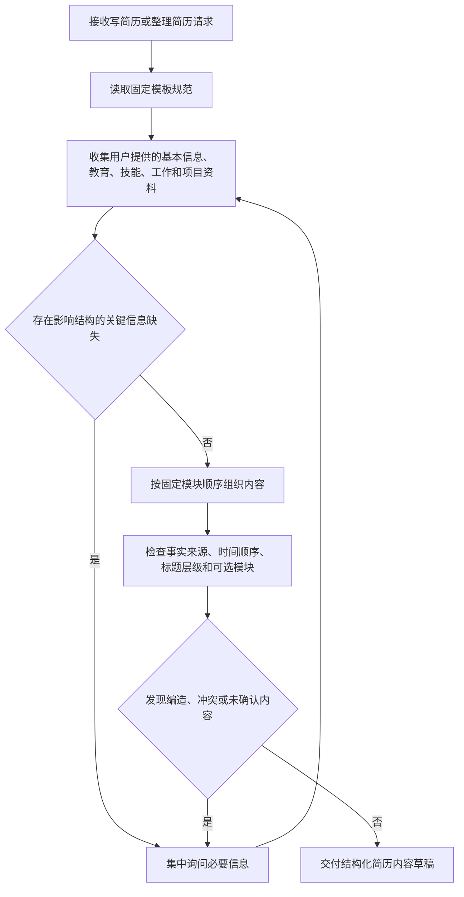

# ResumeForge 插件设计规格

- 日期：2026-08-08
- 状态：用户已批准书面规格，进入实施计划
- 插件名称：`resume-forge`
- 技能名称：`resume-forge`
- 显示名称：ResumeForge 简历工坊
- 命令：`/resume-forge:write`
- 初始版本：`1.0.0`

## 1. 背景与目标

`resume-forge` 是面向 Claude Code 与 Codex 的双平台简历编写插件。插件先依据用户提供的真实教育、技能、工作和项目信息组织简历内容，后续再补充用户提供的写作技巧、润色方法以及 HTML、PDF 渲染能力。

插件使用已经确认的固定简历模板，不自行重新设计模块顺序、标题层级或项目结构。最终 HTML 与 PDF 必须来自同一份简历内容，并保持与样例 PDF 一致的内容结构、标题位置、子标题层级和照片位置。

本插件的目标是：

- 同时被当前仓库支持的 Claude Code 与 Codex 识别和安装。
- 通过统一 Skill 收集、校验并组织用户简历信息。
- 固化已确认的简历内容结构和 A4 版式契约。
- 将“个人优势”作为末尾可选模块。
- 支持用户提供照片，并为后续照片替换、HTML 输出和 PDF 输出建立稳定契约。
- 禁止编造用户经历、职责、技术能力或量化结果。

## 2. 首版范围

首版只交付最小可用插件骨架和简历结构能力：

1. 创建 Claude Code 与 Codex 两套插件清单。
2. 注册到仓库根部两套 marketplace 清单。
3. 创建一个薄命令，将用户参数原样交给 Skill。
4. 创建 `resume-forge` Skill 和 Codex UI 元数据。
5. 将本次确认的简历结构、标题层级、模块位置和照片规则写入独立参考文件。
6. 让 Skill 能够收集信息、识别缺口，并按固定结构组织简历内容草稿。
7. 同步更新仓库 README 和中英文使用说明。

首版默认在对话中以 Markdown 结构化文本交付简历内容草稿，不创建 HTML 或 PDF 文件。

首版不实现：

- 尚未由用户提供的写作技巧、润色方法和内容评价规则。
- HTML 模板的实际生成与落盘。
- PDF 渲染、分页和视觉验收。
- 图片裁剪、编码和嵌入脚本。
- Word、DOCX 或其他格式输出。
- 用户未授权的事实补全或内容夸大。

清单和 Skill 描述只声明首版已经具备的能力，不提前宣称尚未实现的 HTML、PDF 或照片处理能力。

## 3. 项目接入规范

插件严格复用当前仓库的双平台结构，不新增第三套清单或自定义注册格式。

### 3.1 双平台清单

- `plugins/resume-forge/.claude-plugin/plugin.json`：Claude Code 插件元数据。
- `plugins/resume-forge/.codex-plugin/plugin.json`：Codex 插件元数据、Skill 路径和界面信息。
- 两个 `plugin.json` 的名称、版本、描述语义和作者保持一致。
- 插件机器标识、目录名和 Skill 名统一使用小写连字符形式 `resume-forge`。
- 只有面向用户的 `displayName` 使用 `ResumeForge 简历工坊`。

### 3.2 Marketplace 注册

- 在 `.claude-plugin/marketplace.json` 中注册名称、描述、来源和版本。
- 在 `.agents/plugins/marketplace.json` 中注册名称、本地来源、安装策略、认证策略和 `Productivity` 分类。
- 新条目追加到现有插件列表末尾，不重排已有插件。

### 3.3 命令与 Skill

- 命令文件使用现有的 `commands/<plugin-name>-invoke.md` 约定。
- 命令名称为 `resume-forge:write`，只负责要求宿主立即调用 Skill 并传递 `$ARGUMENTS`。
- 业务流程、模板规则和事实约束只写在 Skill 或其参考文件中，不复制到命令文件。
- `agents/openai.yaml` 从 Skill 的真实能力生成，不包含尚未实现的能力。

### 3.4 仓库文档

- 在 `README.md` 的插件列表中追加 `resume-forge`。
- 在 `USAGE.zh.md` 和 `USAGE.en.md` 中追加安装与调用示例。
- 保持现有文档的表格、语言和示例格式。

## 4. 首版目录结构

```text
plugins/resume-forge/
├── .claude-plugin/
│   └── plugin.json
├── .codex-plugin/
│   └── plugin.json
├── commands/
│   └── resume-forge-invoke.md
└── skills/
    └── resume-forge/
        ├── SKILL.md
        ├── agents/
        │   └── openai.yaml
        └── references/
            └── resume-template.md
```

首版不创建空的 `scripts/` 或 `assets/` 目录。需要实现 HTML、PDF 和照片处理时，再增加实际会被使用的资源。

## 5. 简历内容结构契约

简历模块顺序固定为：

```text
基本信息
→ 教育背景
→ 专业技能
→ 工作经历
→ 项目经历
→ 个人优势（可选）
```

### 5.1 基本信息

首页顶部采用左侧文字、右侧照片结构：

- 左上显示姓名。
- 姓名下方显示性别、年龄、工作年限、学历、手机、邮箱、婚姻状况和政治面貌；其中与岗位无关的个人字段允许用户选择不提供。
- 下一行显示现居城市和目标岗位。
- 求职状态或预计到岗时间单独占一行。
- 用户提供照片时，在右上角固定照片区域显示。

### 5.2 一级模块标题

教育背景、专业技能、工作经历、项目经历和个人优势统一使用：

```text
圆环图标 + 青绿色一级标题 + 向右延伸的细横线
```

一级标题必须使用同一字体层级、颜色和间距，不允许不同模块自行变化。

### 5.3 教育背景

教育条目使用三栏标题行：

```text
[起止时间]    [学校名称]    [学习形式/学历 - 专业]
```

语言能力或证书放在教育条目下一行。

### 5.4 专业技能

专业技能采用数字编号和“分类标题 + 冒号 + 能力说明”结构。技能分类根据用户真实情况选择，模板允许包含：

- 编程语言。
- JVM。
- 计算机基础。
- 设计模式。
- 服务端框架。
- AIGC。
- 流程引擎。
- 关系型数据库。
- 非关系型数据库。
- 消息中间件。
- 信息安全。
- Linux 系统。
- 团队协作与版本控制。
- 容器化和自动化部署。

未被用户经历支持的分类不得自动添加。

### 5.5 工作经历

每段工作经历先使用三栏标题行：

```text
[起止时间]    [公司名称]    [岗位名称]
```

标题行下使用“工作内容”子标题，正文采用：

```text
数字编号 + 加粗职责主题 + 冒号 + 职责说明
```

工作经历只描述用户确认的职责范围、角色边界、交付和协作，不把推测性成果写成事实。

### 5.6 项目经历

每个项目先使用三栏标题行：

```text
[起止时间]    [项目名称]    [项目角色]
```

项目内部顺序固定为：

```text
项目背景
→ 技术栈
→ 工作内容
```

工作内容使用数字编号。复杂模块允许使用 `(1)`、`(2)` 等第二级编号，但层级和缩进必须保持一致。

### 5.7 个人优势

“个人优势”位于简历末尾，是完整的可选模块：

- 用户需要时显示标题和全部内容。
- 用户不需要或没有内容时，整个模块不输出，也不保留空白占位。
- 每条内容使用“优势主题 + 经历证据 + 实际价值”结构。
- 不使用没有事实支撑的空泛评价。

## 6. A4 视觉结构契约

后续 HTML 和 PDF 必须遵守以下固定视觉基线：

- 页面：A4 纵向、白色背景、单栏正文。
- 左右页边距：约 18 mm。
- 中文字体：Microsoft YaHei；无该字体时使用兼容的中文无衬线字体回退。
- 英文和数字：Helvetica Neue；无该字体时使用兼容无衬线字体回退。
- 正文颜色：`#444444`。
- 一级标题颜色：`#467B73`。
- 项目字段标题颜色：`#016866`。
- 姓名：约 22–23 pt。
- 一级标题：约 14 pt。
- 正文：约 9.3–9.5 pt，行距约 1.5–1.6。
- 经历标题行按约 `30% / 45% / 25%` 分配时间、名称和角色，最后一栏右对齐。
- 不使用会破坏文本提取顺序的独立图片文字或复杂侧栏。

页面数量由真实内容决定，不把样例 PDF 的三页硬编码为固定页数。跨页不得造成标题与正文分离、单独悬挂的项目标题或内容裁切。

## 7. 照片契约

### 7.1 输入与替换

- 接受用户在会话中附加的图片，或用户明确指定的本地图片路径。
- 照片输入格式限定为 JPEG、PNG 或 WebP。
- 用户指定新照片时，只替换简历照片源并重新渲染，不改动其他简历内容。
- 不覆盖、改名或修改用户原始图片。
- 没有照片时，不显示空照片框，页首文字区域扩展到完整正文宽度。

### 7.2 显示规则

- 照片位于首页右上角固定区域，目标尺寸约 `27 × 32 mm`。
- 默认保持图片比例，并使用覆盖式裁剪适配照片框。
- 默认视觉焦点为顶部居中，适配常见证件照和人像照片。
- 用户明确指定裁剪位置或完整显示时，以用户要求为准。

### 7.3 HTML 与 PDF 一致性

- 最终 HTML 内嵌照片数据，不依赖容易失效的外部相对路径。
- PDF 从同一份 HTML 渲染，禁止为 PDF 单独维护另一份照片或内容模板。
- 替换照片后必须同时验证 HTML 和 PDF 中的照片已经更新。

### 7.4 异常处理

- 图片不存在、不可读或不是受支持的图片格式时，停止最终渲染并说明具体问题。
- 图片分辨率不足时明确提示清晰度风险，不静默放大并声称质量正常。
- 图片比例不适合默认照片框时，先采用可逆的显示裁剪，不修改源文件。

## 8. Skill 首版工作流



首版 Skill 必须：

- 读取 `references/resume-template.md` 后再组织内容。
- 优先使用用户提供的简历、笔记、资料和明确回答。
- 缺少会改变内容的事实时询问用户，不自行补齐。
- 按时间倒序组织工作经历和项目经历。
- 不把模板示例中的技术、公司、项目或指标写入其他用户简历。
- 在首版尚未实现渲染时，明确说明当前交付是结构化内容草稿。

## 9. 后续 HTML/PDF 架构

后续功能遵循单一内容源：

```text
用户资料与指定照片
        ↓
标准化简历数据
        ↓
固定内容结构
        ↓
A4 HTML 模板
        ↓
自包含 HTML
        ↓
同源渲染 PDF
```

后续新增资源预计按项目现有约定放入：

```text
skills/resume-forge/
├── assets/
│   └── resume-a4-template.html
├── references/
│   └── resume-writing-guidelines.md
└── scripts/
    ├── build_resume_html.*
    └── render_resume_pdf.*
```

实际脚本语言、渲染器和文件名在进入该阶段时依据仓库已有工具、运行环境和验证结果确定；当前版本不创建空文件或伪实现。

## 10. 验证要求

### 10.1 首版验证

- 校验 `.claude-plugin/plugin.json` 与 `.codex-plugin/plugin.json` 的名称和版本一致。
- 校验两个 marketplace 均包含 `resume-forge` 且来源路径正确。
- 校验 Codex marketplace 的安装、认证策略和分类字段完整。
- 校验命令能够把 `$ARGUMENTS` 交给正确 Skill。
- 使用 Skill Creator 的 `quick_validate.py` 校验 Skill。
- 使用 Plugin Creator 的 `validate_plugin.py` 校验插件。
- 检查 README 和中英文使用说明均已注册新插件。
- 确认没有遗留未完成标记、模板占位说明或空资源目录。

### 10.2 后续渲染验证

- HTML 必须自包含并能离线显示。
- HTML 与 PDF 的模块顺序、文案、照片和标题层级一致。
- 完整渲染所有 PDF 页面，检查裁切、重叠、乱码、孤行和分页。
- 检查照片清晰、比例正常、位置正确且确为用户指定图片。
- 检查 PDF 文本可选择、技术关键词可提取，联系方式不被转成图片。
- 验证无照片、替换照片、超长内容和可选“个人优势”四类场景。

## 11. 演进边界

- 用户后续提供的写作技巧和方法单独进入参考文件，不把大段规则塞入 `SKILL.md`。
- `SKILL.md` 只保留触发条件、主流程、资料加载条件和最终门禁。
- 固定模板属于结构契约；写作规则属于内容质量契约；HTML/PDF 脚本属于确定性渲染层，三者保持独立。
- 结构模板发生变化时，必须同步检查 HTML 模板、PDF 输出和照片布局。
- 新增输出格式、外部服务或依赖前，先确认用户需求并遵循仓库现有技术选择。
