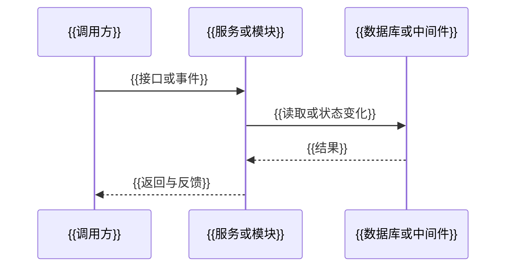

> [!summary] 文档定位
> {{以冻结事实说明本设计的业务定位、设计模式、实现设计基线和范围，必须全部替换。}}

> [!important] 落盘门禁
> 本文件仅为骨架。必须用已冻结事实替换所有替换标记，删除不适用章节并说明其依据，完成图文与字段级审查后，运行 `validate_design_document.py` 通过方可写入知识库。

## 设计依据与关联文档

| 关联文档 | 类型 | 使用内容 | 影响章节 |
| --- | --- | --- | --- |
| [[{{正文实际引用的知识库文档，必须全部替换}}]] | {{资料类型}} | {{核验内容}} | {{受影响章节}} |

## 设计目标与范围

### 目标

{{目标与可观察结果}}

### 范围与不做事项

{{范围、边界和明确不做事项}}

## 当前能力与目标差异

| 项目 | 当前系统事实 | 目标需求或新增设计定义 | 差异影响 | 依据 |
| --- | --- | --- | --- | --- |

## 统一术语与命名

| 规范名称 | 类型 | 定义与适用边界 | 来源或新增设计依据 | 禁止混用名称 |
| --- | --- | --- | --- | --- |

## 总体架构与模块职责

{{按实际架构保留单体模块或分布式服务说明；每个服务写明数据归属和依赖。}}

| 组件或服务 | 类型 | 职责 | 数据归属 | 上游 | 下游 | 事实或设计依据 |
| --- | --- | --- | --- | --- | --- | --- |

```mermaid
flowchart LR
    A[{{参与方或上游}}] --> B[{{模块或服务}}]
    B --> C[{{数据存储或中间件}}]
```

## 全流程交互设计

| 链路 | 触发与主体 | 调用方行为 | 接口或事件 | 服务处理 | 数据或中间件变化 | 返回与反馈 | 中断恢复 |
| --- | --- | --- | --- | --- | --- | --- | --- |



```mermaid
flowchart TD
    A[{{触发}}] --> B[{{校验或条件}}]
    B -->|{{成功}}| C[{{处理与状态变化}}]
    B -->|{{异常、重复或竞争}}| D[{{反馈、重试、补偿或人工恢复}}]
```

## 状态模型与生命周期

| 状态域 | 状态 | 进入条件 | 合法后继状态 | 退出动作 | 生产者与消费者 | 恢复规则 |
| --- | --- | --- | --- | --- | --- | --- |

```mermaid
stateDiagram-v2
    [*] --> {{初始状态}}
    {{初始状态}} --> {{目标状态}}: {{触发条件}}
    {{目标状态}} --> [*]
```

## 接口契约

### {{接口名称}}

| 项目 | 定义 |
| --- | --- |
| URL | {{精确 URL}} |
| Method | {{HTTP Method}} |
| 调用方与使用场景 | {{调用方}} |
| 鉴权与权限 | {{鉴权与权限边界}} |
| 调用前置条件 | {{前置状态或条件}} |
| 幂等规则 | {{幂等键、重复请求结果与有效期}} |
| 状态变化与数据影响 | {{状态与表、中间件变化}} |
| 后续动作 | {{返回后调用方、服务或任务行为}} |

| 位置 | 字段名 | 类型 | 必填 | 长度/格式 | 枚举/约束 | 业务语义 | 示例 |
| --- | --- | --- | --- | --- | --- | --- | --- |

| 字段名 | 类型 | 可空 | 状态/枚举 | 业务语义 | 来源 |
| --- | --- | --- | --- | --- | --- |

| 错误码 | HTTP 状态 | 触发条件 | 调用方处理 | 用户或上游反馈 |
| --- | --- | --- | --- | --- |

## 数据模型与数据库设计

### {{表或实体名称}}

{{业务职责、生产者、消费者、生命周期与实际数据库名称。不得提供可执行 DDL。}}

| 字段名 | 类型 | 长度 | 可空 | 默认值 | 约束/索引 | 业务语义 | 生命周期 |
| --- | --- | --- | --- | --- | --- | --- | --- |

| 前端字段 | 接口字段 | 领域概念 | 数据库字段 | 转换规则 |
| --- | --- | --- | --- | --- |

```mermaid
erDiagram
    {{实体一}} ||--o{ {{实体二}} : {{逻辑关联}}
```

## 中间件与外部系统

| 类型 | 名称或标识 | 作用 | 生产或调用条件 | 消费或回调处理 | 失败、重复与恢复 | 事实依据 |
| --- | --- | --- | --- | --- | --- | --- |

## 权限与安全

| 边界 | 主体或角色 | 校验位置 | 规则 | 敏感信息处理 | 拒绝反馈 |
| --- | --- | --- | --- | --- | --- |

## 幂等、并发、一致性与事务

| 写入或状态迁移 | 发起方 | 本地事务边界 | 跨资源一致性目标 | 并发控制 | 提交后动作 | 失败与恢复责任 |
| --- | --- | --- | --- | --- | --- | --- |

## 异常、降级、重试与补偿

| 场景 | 幂等或并发规则 | 超时与错误分类 | 重试规则 | 补偿或人工恢复 | 对调用方的结果 |
| --- | --- | --- | --- | --- | --- |

## 风险与范围外事项

| 事项 | 风险或限制 | 影响 | 已确认边界或后续责任 |
| --- | --- | --- | --- |

## 验收与实现设计就绪检查

| 验收场景 | 覆盖链路与状态 | 预期数据或中间件变化 | 预期反馈与恢复 |
| --- | --- | --- | --- |

- [ ] {{所有关键事实、冲突裁决和命名均已冻结}}
- [ ] {{成功、异常、重复、部分成功、中断恢复和并发场景按实际情况闭环}}
- [ ] {{接口、数据库、状态、图和正文达到字段级一致}}
- [ ] {{仅保留真实涉及的架构与中间件能力，并通过机械校验}}
